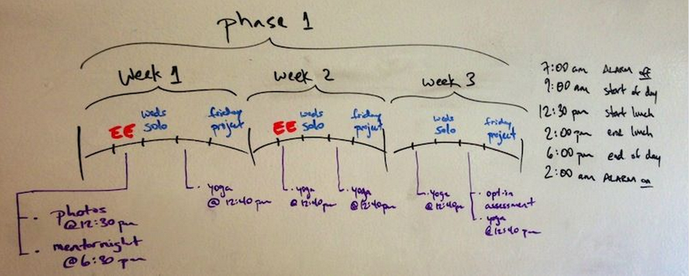

## Phase 1 README
### What should I be working on right now?
- Week 1:
  - [Monday](week-1/monday.md)
  - [Tuesday](week-1/tuesday.md)
  - [Wednesday](https://gist.github.com/brickthorn/c207b922a45c3880a58d)
  - [Thursday](https://gist.github.com/brickthorn/9308e8ade224c58797a8)
  - [Friday](https://gist.github.com/brickthorn/3d39e0fd643c889fe839)
  - [Weekend](https://gist.github.com/brickthorn/6a5f9d0e8b553081b4b0)

- Week 2:
  - [Monday](https://gist.github.com/brickthorn/73d66ed3de195561ea37)
  - [Tuesdays](https://gist.github.com/labe/ed256a6b4f48b7d87273)
  - [Wednesday](https://gist.github.com/labe/333bb6be122deac6e939)
  - [Thursday](https://gist.github.com/labe/722a8969c33ae83e503b)
  - [Friday](https://gist.github.com/labe/01b84a75712a7897bdf6)
  - [Weekend](https://gist.github.com/labe/2ae0b23a790c9ea77663)

- Week 3:
  - [Monday](https://gist.github.com/brickthorn/69c7b85b3e7c5c5d802a)
  - [Tuesday](https://gist.github.com/brickthorn/6e123310a226ffbb374f)
  - [Wednesday](https://gist.github.com/brickthorn/c9e882f069219257f4ae)
  - [Thursday](https://gist.github.com/brickthorn/5c005925cc66a70e5599)
  - **[Friday](https://gist.github.com/brickthorn/f1c97148ea2acdb1387c)**
  - Weekend

### What are my learning goals?
- [Week 1](https://gist.github.com/dbc-challenges/3e4ea14543cde43d89ca)
- [Week 2](https://gist.github.com/dbc-challenges/3c983819a8604593791b)
- [Week 3](https://gist.github.com/dbc-challenges/1da8d51de6229fedd73a)

### What is our working agreement?

- We meet with our accountability buddies at 8:45am sharp every week day. (Text or call your buddies if they are not present. We won't start our meeting until all boots are accounted for.)
- We meet in the Cave every morning at 9 am sharp.
- We meet in the Cave every afternoon at 2 pm sharp.
- Our top priorities for this phase are:
  - Learning how to respond appropriately (vs. react… to error messages, challenges, and self talk)
  - Learning how to communicate (what you're feeling, thinking, and needing)
  - Learning how to build and use mental models
  - Seeking opportunities to help each other, grow as individuals, and as a tribe

### What is our schedule?

